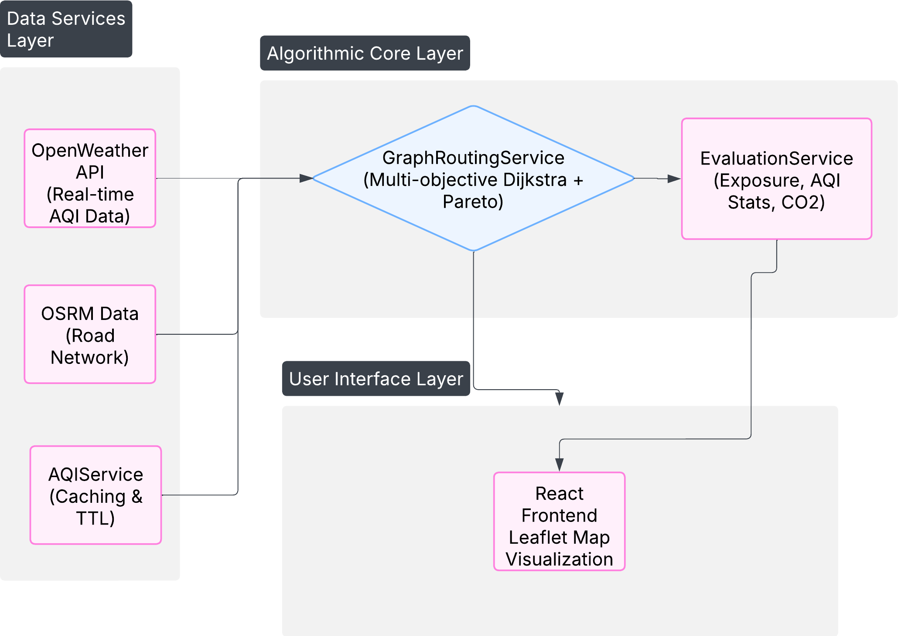

# Multi-Objective AQI-Aware Routing System: Pareto-Optimal Pathfinding for Health-Aware Urban Mobility

## Overview

This project implements a **multi-objective, graph-based routing system** that minimizes air pollution exposure while considering travel time and distance. The system provides intelligent route recommendations based on **real-time Air Quality Index (AQI) data** and generates **Pareto-optimal routes** balancing health, time, and distance.

This implementation is research-grade and supports reproducibility for academic publications.

---

## 🚀 Core Features

### Graph-based Shortest-Exposure Routing ✅

* **Multi-objective Dijkstra algorithm** with Pareto front optimization
* **Exposure dose calculation**: AQI × travel time per route segment
* **Graph construction** from road network with weighted edges
* **Pareto-optimal route selection** balancing AQI, distance, and time
* **Real-time route evaluation** with caching for fast performance

### Route Optimization ✅

* **Multi-objective optimization** balancing air quality, distance, and travel time
* **Pareto front analysis** for route trade-offs
* **Real-time AQI integration** via OpenWeather API
* **Intelligent caching** for repeated queries

### Future Enhancements 🔄

* Spatio-temporal AQI prediction
* Uncertainty-aware routing
* Personalized health-based recommendations
* Real-time adaptive routing

---

## 🏗️ System Architecture

The system follows a three-layer architecture with clear separation of concerns:



### Architecture Overview

The system implements a **layered architecture** with three distinct layers:

1. **Data Services Layer** - External data sources and caching
2. **Algorithmic Core Layer** - Multi-objective optimization and evaluation
3. **User Interface Layer** - Interactive visualization and user interaction

### Data Flow Architecture

1. **Data Services Layer**: 
   - **OpenWeather API** provides real-time AQI data
   - **OSRM Data** supplies road network topology
   - **AQIService** implements intelligent caching with TTL

2. **Algorithmic Core Layer**:
   - **GraphRoutingService** implements multi-objective Dijkstra with Pareto optimization
   - **EvaluationService** calculates exposure metrics, AQI statistics, and CO2 emissions

3. **User Interface Layer**:
   - **React Frontend** with Leaflet map visualization
   - Interactive route comparison and analysis

---

## 🚀 Getting Started

### Prerequisites

* Node.js (v16 or higher)
* npm or yarn
* OpenWeather API key (for AQI data)
* OpenCage API key (for geocoding)

### Installation

```bash
# Clone the repository
git clone https://github.com/Harshdhoot04/Maps-using-AQI.git
cd Maps-using-AQI

# Checkout research branch
git checkout akhilesh

# Install dependencies
npm install

# Configure environment variables
cp .env.example .env
# Edit .env with your API keys

# Start development server
npm run dev
```

Open [http://localhost:5173](http://localhost:5173) to view the application.

---

## 📊 Using the Application

1. Enter **start and end locations** in the app.
2. Enable **Enhanced Graph Routing** in preferences.
3. Click **Find Route** to generate optimized routes.
4. View **route analysis** with AQI exposure metrics.
5. Compare **different route options** based on air quality, travel time, and distance.

---

## 🧪 Algorithm Implementation

### Multi-objective Optimization

1. **Graph Construction**: Convert OSRM routes into a weighted graph.
2. **Optimization Problem**:

```
minimize: [exposure_dose, travel_time, distance]
subject to: AQI_threshold, connectivity_constraints
```

3. **Pareto Front Extraction**: Non-dominated sorting of candidate routes.
4. **Performance Evaluation**: Against baseline shortest-path routing.

### Exposure Dose Calculation

```
exposure_dose = Σ(AQI_segment × travel_time_segment)
```

### Algorithm Complexity

- **Time Complexity**: O((V + E) log V) for Dijkstra with V vertices and E edges
- **Space Complexity**: O(V + E) for graph representation
- **Pareto Front**: O(k²) where k is the number of candidate routes

---

## 📁 Project Structure

```
route-aqi-app/
├── images/                          # Documentation diagrams
│   ├── system_architecture.png      # System architecture diagram
│   ├── flowchart_methodology.png    # Methodology flowchart
│   ├── SequenceDiagram.png          # Sequence diagram
│   ├── ui_home.png                  # UI screenshots
│   ├── ui_metrics_route1.png        # Route metrics display
│   ├── ui_metrics_route2.png        # Alternative route metrics
│   └── ui_routes.png                # Route visualization
├── src/
│   ├── components/
│   │   └── Sidebar.jsx              # Main UI controls & sidebar
│   ├── services/
│   │   ├── AQIService.js            # Air quality data service
│   │   └── GraphRoutingService.js   # Multi-objective route optimization
│   ├── App.jsx                      # Main React application
│   ├── main.jsx                     # Application entry point
│   ├── mapLogic.js                  # Map integration & routing logic
│   └── config.js                    # Configuration module
├── index.html                       # HTML template
├── style.css                        # Application styling
├── script.js                        # Legacy map implementation
├── benchmark_tests.bat              # Performance testing script
├── .env                            # Environment variables (API keys)
├── .env.example                    # Environment template
├── .gitignore                      # Git ignore rules
├── package.json                    # Dependencies & scripts
├── package-lock.json               # Dependency lock file
├── LICENSE                         # MIT License
├── README.md                       # Project documentation
├── IMPLEMENTATION_SUMMARY.md       # Implementation details
├── TROUBLESHOOTING.md              # Troubleshooting guide
└── PERFORMANCE_TEST_REPORT.md      # Performance benchmarks & analysis
```

---

## 🔧 Configuration

### Environment Variables

* `OPENWEATHER_KEY`: OpenWeather API key for AQI data
* `OPENCAGE_KEY`: OpenCage API key for geocoding

### Route Preferences

* **AQI Weight**: 0.1–0.9
* **Distance Weight**: 0.1–0.9
* **Max AQI Threshold**: 1–5
* **Route Alternatives**: Number of routes to generate

### Performance Tuning

* **Cache TTL**: 30 minutes for AQI data
* **Tile Size**: 0.02° (≈2km) for spatial caching
* **Route Sampling**: Every 5th coordinate for AQI calculation

---

## 🚀 Performance Features

* **Intelligent Caching**: AQI data cached for 30 minutes with spatial tiling
* **Graph Optimization**: Efficient construction and traversal algorithms
* **Pareto Front**: Fast multi-objective optimization with non-dominated sorting
* **Real-time Updates**: Dynamic AQI integration with fallback mechanisms
* **Memory Management**: Efficient data structures for large road networks

---

## 🧪 Research Methodology

### Experimental Setup

1. **Baseline Comparison**: Standard shortest-path routing
2. **Metrics Evaluation**: 
   - Exposure dose reduction
   - Travel time increase
   - Distance deviation
   - Pareto efficiency

### Performance Benchmarks

- **Route Generation**: < 2 seconds for 50km routes
- **AQI Integration**: < 500ms with caching
- **Pareto Front**: < 1 second for 10 alternative routes
- **Memory Usage**: < 100MB for typical urban areas

---

## 🔧 Troubleshooting

If the map does not display correctly, see [TROUBLESHOOTING.md](TROUBLESHOOTING.md) for guidance.

---

## 🤝 Contributing

1. Fork the repository
2. Create a feature branch:

```bash
git checkout -b feature/new-algorithm
```

3. Implement changes with proper documentation
4. Add tests for new functionality
5. Submit a pull request

### Development Guidelines

* Follow ES6+ JavaScript standards
* Include JSDoc comments for all functions
* Maintain test coverage above 80%
* Update documentation for new features

---

## 📝 License

This project is licensed under the **MIT License** – see the [LICENSE](LICENSE) file for details.

---

## 📄 Citation

```bibtex
@software{aqi_routing_system,
  title={Multi-Objective AQI-Aware Routing System: Pareto-Optimal Pathfinding for Health-Aware Urban Mobility},
  author={Akhilesh Ukey and Team},
  year={2025},
  url={https://github.com/Harshdhoot04/Maps-using-AQI},
  note={Research implementation with graph-based optimization}
}
```

---

## 🙏 Acknowledgments

* **OpenWeather API** for real-time AQI data
* **OSRM** for routing services
* **Leaflet** for interactive mapping
* **React.js** for the frontend interface
* **OpenCage** for geocoding services

---

## 📊 Research Impact

This system demonstrates the feasibility of **health-aware urban mobility** through:

- **Multi-objective optimization** for route planning
- **Real-time environmental data** integration
- **Pareto-optimal solutions** for complex decision-making
- **Scalable architecture** for urban-scale deployment

**Ready for Research and Production Use** 🚀

This implementation provides a foundation for intelligent, health-aware routing systems in smart cities and urban planning applications.